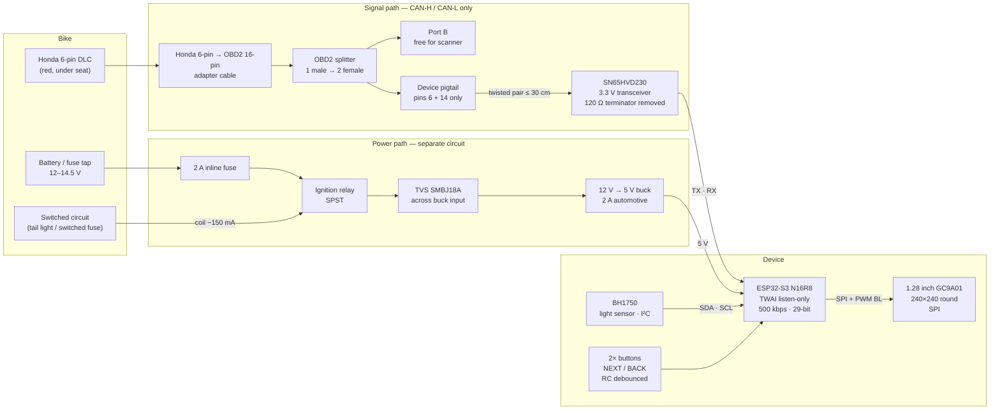
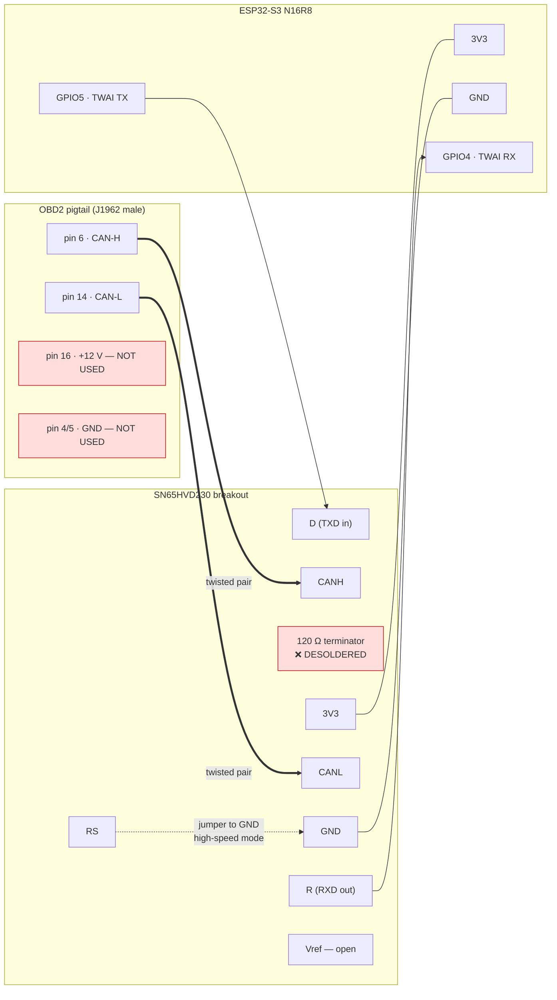
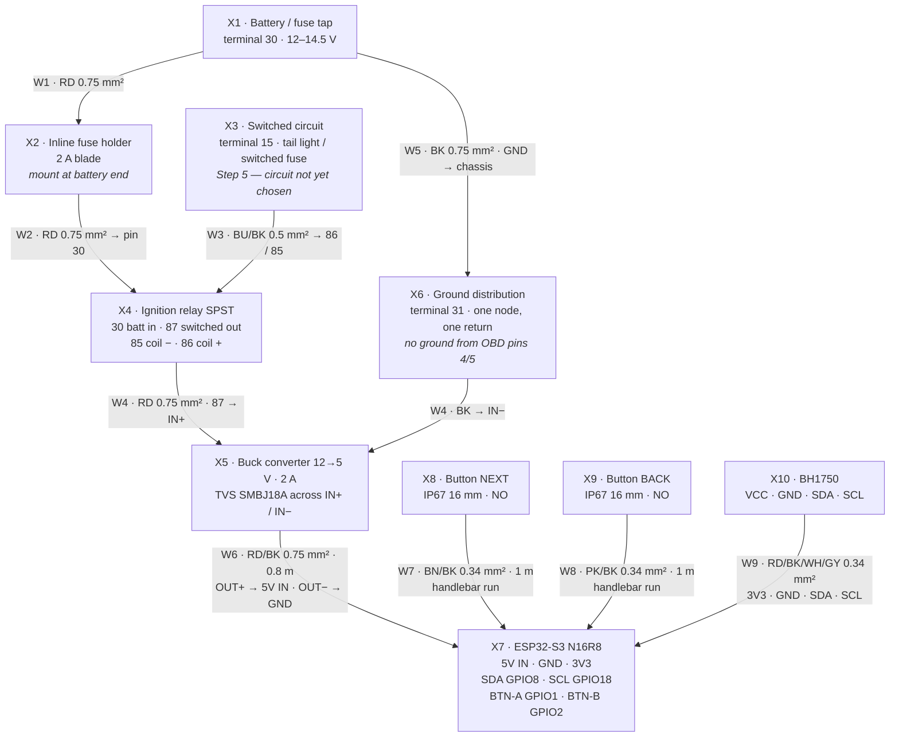
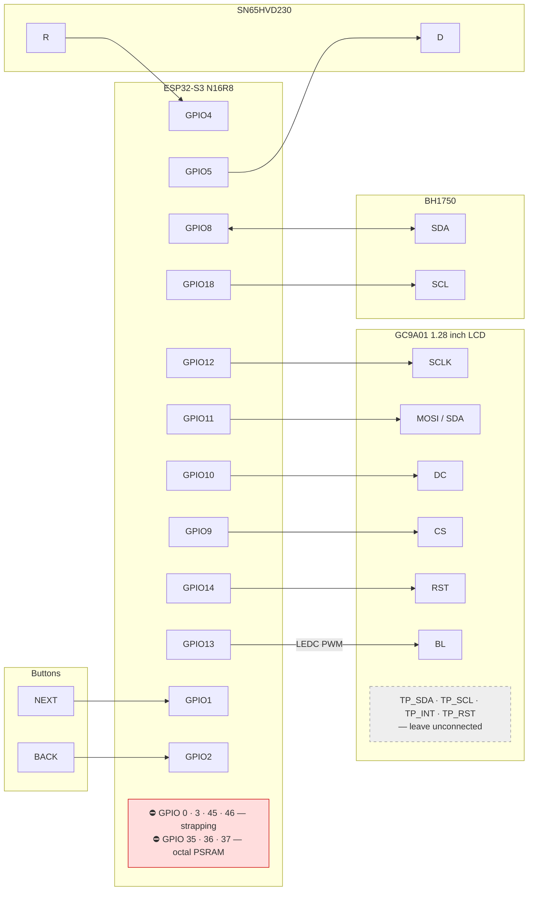
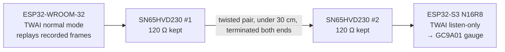

# Wiring Diagrams — OBD2 Tachometer Display

Mermaid versions of the harness drawings. Source of truth for pin numbers is the [[OBD2 Tachometer Display]] note, §7 pin plan.

> [!warning] Step 0 first
> Everything below assumes the bike has the **6-pin** DLC (CAN). Verify by eye before trusting any of it.

---

## 1. System overview

---

## 2. Signal harness (RT-HARN-SIG rev B)

Two conductors only. Listen-only — the device never transmits. Mated connector pairs are shown as one junction.

```mermaid
flowchart LR
    X1["X1 · Honda 6-pin DLC<br/>CAN-H pin ?<br/>CAN-L pin ?<br/><i>Step 0 — not yet verified</i>"]
    X2["X2 · OBD-II junction J1962<br/>adapter female + splitter<br/>pin 6 = CAN-H<br/>pin 14 = CAN-L"]
    X3["X3 · Device pigtail<br/>J1962 male, solderable<br/>pads 6 + 14 only<br/><i>nothing on 16 / 4 / 5</i>"]
    X4["X4 · SN65HVD230<br/>CANH · CANL<br/>3V3 · GND · D · R<br/>RS → GND · Vref open"]
    X5["X5 · ESP32-S3 N16R8<br/>3V3 · GND<br/>TWAI-TX GPIO5<br/>TWAI-RX GPIO4"]

    X1 -->|"W1 · purchased adapter<br/>0.5 mm² · 0.4 m"| X2
    X2 -->|"WM · mated pair<br/>no wire"| X3
    X3 -->|"W2 · CAN stub<br/>twisted 2–3 turns/cm<br/>0.5 mm² · ≤ 0.25 m"| X4
    X4 -->|"W3 · logic tail<br/>4 × 0.34 mm² · 0.15 m"| X5
```

**Check before proceeding:** ignition off, ~60 Ω between X2 pin 6 and pin 14 (two 120 Ω terminators in parallel). Open circuit → the adapter's CAN pins aren't populated.

---

## 3. OBD2 pigtail → transceiver → ESP32 (pin level)

Six wires total: two to the bike, four to the ESP32. One jumper stays on the module.

---

## 4. Power harness (RT-HARN-PWR rev B)

Independent of the signal path — nothing here touches the diagnostic connector. DIN 72552 terminal numbers: 30 = permanent battery, 15 = switched, 31 = ground.

**Button RC (each):** 10 kΩ pull-up to 3V3, 100 nF to GND at the GPIO, switch pulls low. ~1 ms time constant. Not optional — the handlebar run is an antenna next to the ignition leads.

**Additional BOM:** TVS SMBJ18A ×1 (at X5), 10 kΩ ×2, 100 nF ×2.

---

## 5. ESP32-S3 N16R8 pin map

LCD VCC → 3V3, GND → GND. Transceiver and BH1750 also on 3V3.

---

## 6. Bench CAN test rig (no bike)

On the bench **both** transceivers keep their 120 Ω terminators — it's a two-node bus. Remove the one on the bike-side module only when it goes on the real bus.
